<div align="center">


# Yakuyomi

**A manga reader with on-device AI translation.**

English ｜ [中文](README_zh.md)

[](LICENSE-YAKUYOMI.md)
[](https://github.com/joyeli/Yakuyomi/releases/latest)

</div>

Yakuyomi is a fork of [mihon](https://github.com/mihonapp/mihon) that translates manga as you download or read it — Japanese to Traditional Chinese by default, any language pair configurable. Text **detection, OCR, and removal run on the device** (all three models on NCNN, CPU only); only the **translation** step calls a cloud LLM. It also has a **night-reading mode** that darkens the pages themselves, on the device too. The engine is a separate repo, [yakuyomi-engine](https://github.com/joyeli/yakuyomi-engine), pulled in here as a submodule.

<div align="center">
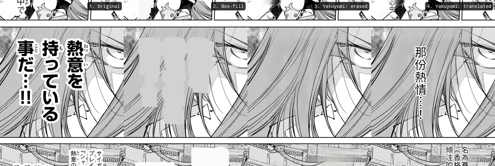
<br>
<sub><b>Text over art — hair, faces, backgrounds — is where box-fill / overlay translators fall apart.</b> Yakuyomi erases the original and reconstructs the artwork (3), then typesets the translation back in (4).</sub>
</div>

## What makes Yakuyomi different

Everything below is on top of stock mihon — at a glance, what you get here that other forks don't:

**Translation**
- **Real inpainting, not overlays** — other translation forks paint a box over the text or stamp new text on top. Yakuyomi *erases* the original and **reconstructs the artwork** (AOT-GAN inpainting) before typesetting the translation back into the bubble.
- **On-device pipeline (all NCNN, pure CPU)** — detection (DBNet), OCR (48px CTC) and text removal (AOT-GAN) all run on **NCNN**'s mobile kernels; the engine no longer depends on ONNX Runtime at all, which alone takes ~70 MB off the APK. OCR is a **mixed-precision** build — fp16 backbone, fp32 transformer + character head — that on a Snapdragon 8 Gen 3 agrees with an fp32 reference on **241 of 242 lines** across 9 pages (the one line they disagree on, the reference got wrong; no line comes back empty) and runs **~23% faster** than the int8 model it replaces (11.3 s vs 14.6 s over those pages, ~1.25 s/page). Detection averages ~0.79 s/page, and the DBNet detector reads ~1.6–2.5× more text correctly than the one it replaced. Pure CPU (GPU/NPU was tried and doesn't help these models). Only the LLM translation call leaves your device; no image ever leaves the phone.
- **Cross-page pipeline** — pages translate concurrently: while one page waits on the cloud LLM, the next page's on-device detection / OCR / removal is already running. With fast (box-fill) removal this reaches the network-bound ceiling — roughly **double** the sequential throughput. AI removal, the default for both downloads and live translation, is CPU-bound, so two pages are kept in flight instead of four.
- **Two workflows** — translate-on-download (whole chapters in the background) and live translation while you read. A page is overwritten only when its translation succeeds; nothing is ever replaced with something worse.
- **Queue tab** — the bottom bar's Updates tab is replaced by **Queue**: translation and night-page jobs grouped by title, where you can pause or resume, push a title to the front, cancel, or retry failed chapters. Updates is still there, on the More tab.
- **Re-render without re-translating** — switch a translated chapter or page to another text-removal method or new typesetting settings (select chapters › *Re-render*, or long-press a page › *Text removal*) without re-running OCR or the LLM. It needs the per-page materials, so turn on *Keep re-render materials* in Settings › Translation (off by default; roughly doubles storage). While live translation is on, the materials are always kept.
- **Your provider, your key** — any OpenAI-compatible LLM (DeepSeek by default; OpenAI, Gemini, Groq, Qwen, OpenRouter, self-hosted Sakura, custom), per-provider encrypted keys, live model list ([providers doc](https://github.com/joyeli/yakuyomi-engine/blob/main/docs/PROVIDERS.md)).
- **Your models** — the translation model set (~250 MB: NCNN `.param` + `.bin` pairs for detection and inpainting, plus two OCR `.param` files — full precision and mixed precision — sharing one `.bin`; the mixed build needs an ARMv8.2 CPU with fp16, and the engine falls back to full precision otherwise) downloads in one tap with sha256 verification, or you supply them manually ([models doc](https://github.com/joyeli/yakuyomi-engine/blob/main/docs/MODELS.md)). If you're upgrading, the app prompts you to update the models.
- **Quality knobs** — two text-removal modes (fast flat-fill / AI inpainting), vertical/horizontal typesetting, ~20 tunable parameters. No telemetry; the optional diagnostic log (Settings › Advanced, off by default) stays on the device until you share it and never records your API key.

<div align="center">

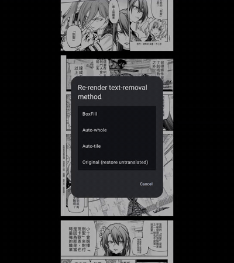
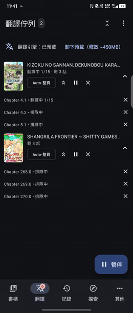
<br>
<sub><b>Live translation as you read</b>, <b>one-tap re-render</b> of the text-removal method, and a <b>per-manga translation queue</b> — expand chapters, jump a title to the front, pause it.</sub>
</div>

**Night reading**
- **The page itself goes dark, not a color filter** — paper, panel gutters, page margins and speech bubbles are painted black with the text drawn light, and the artwork is dimmed rather than inverted. Characters are protected: two on-device character-segmentation models find them and, in nearly all cases, keep them out of the fill. Each night page is a separate copy saved in the chapter folder; the original page is never touched. It works on translated and untranslated manga alike and needs no LLM key.
- **Two levels** — *Standard* blacks out gutters, margins, bubbles and large, simple white areas. *More* also takes smaller plain backgrounds, judged by whether anything is drawn in them: an empty sky or a plain gradient goes black, while walls, windows and scenery stay. Radiating focus lines are blacked between the lines with the lines kept light, and sparkles stay light. Busy artwork and characters are kept out of the fill at both levels. Both levels are generated in one pass, so switching between them is instant.
- **Floating switch in the reader** — with night reading on, a small translucent button sits over the page: tap it to switch between day and night, and in night mode two signal-bar buttons pick *Standard* or *More*. Long-press a button for a hint; the button can sit on either side of the screen.
- **Generated in the background** — turn on *Auto-generate night pages* and chapters get night versions after they download (after translation, for manga you translate). Night jobs share the **Queue** tab with translation; translation and night reading pause separately, and you can also pause a single title or a single chapter. When nothing else is running, a few night pages render at once; as soon as translation or live translation is working, night reading drops to one page at a time so it doesn't slow translation down. You can also tap the moon on a chapter row, select several chapters, or pick *Generate night pages for this chapter* from the reader's long-press menu. For a chapter you're reading online, Yakuyomi asks first, downloads it, then generates the night version.
- **Settings › Night reading** — the master switch (also on the More tab), the fill level (*Standard* / *More*, synced with the reader's floating button), which categories and sources get night pages automatically, skip color pages, brightness presets (Standard / Soft / Softer) or individual sliders, how many pages to process at once, a *Keep working with the screen off* row (under Background processing) that explains why the system may freeze the queues with the screen off and lets you lift battery optimization for the app, the night models (download / delete), and the space night pages use, with *Clear night versions of read chapters* / *Clear all night versions*. When the night-reading rules improve, chapters with older pages are marked, and *Regenerate outdated night pages* redoes them in one tap.
- **Models** — download the night models in Settings › Night reading: two character-segmentation models, about **147 MB**; the text detector is shared with translation (about 153 MB more if you haven't downloaded the translation models). These two are **not** GPL-3.0 and are redistributed for research / non-commercial use only — see [LICENSE-YAKUYOMI.md](LICENSE-YAKUYOMI.md). Night pages work for chapters downloaded as image folders, not CBZ archives.

<div align="center">
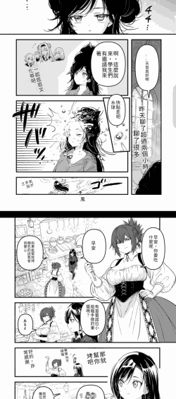
<br>
<sub><b>Night reading</b> — the page itself turns dark: paper, gutters and bubbles go black, text stays readable, characters are only dimmed.</sub>
</div>

**Capture**
- **Built-in browser, saved as a chapter** — open *Capture manga* on the More tab, go to any address in Yakuyomi's full-screen browser (with favorites and URL history), and save what it renders as page images in your local library. The result is an ordinary local manga: read it, file it in a category, and run it through the same on-device OCR and translation pipeline as everything else.
- **Semi-automatic or hands-free** — a frame-diff detector (the screen settled *and* the content actually changed) saves each new page by itself while you swipe, skipping the near-blank frames a page shows while it loads. Set a tap position once and it turns the pages itself — a simulated touch, no scripts injected into the page — for a whole chapter unattended.
- **Four ways it stops** — the page count you entered is reached, two taps in a row leave the screen unchanged (last page, or the tap position is off), pages can't be saved (no title or chapter set, or writing to storage keeps failing), or you stop it yourself. When it stops on its own, the review screen says why.
- **Per-site settings, remembered by domain** — canvas width (narrow the page on a wide screen so a full page fits in one shot), draggable trim lines (or *Auto-detect*) for a site's header and footer (marked by a persistent grey overlay), auto-trim for the blank margins that spreads and short pages leave behind, and the tap position and delay used for automatic page turns.
- **Review before it becomes a chapter** — stopping opens a three-column thumbnail grid: tick pages to delete, re-capture a single page (it reopens the address that page came from), insert a page you missed between two others, keep capturing, or save — saved pages are renumbered into a gapless sequence. The title can be lifted from the page title, the cover is a drag-to-frame crop, and **Continue capturing** on a local manga's detail page reopens the original address and appends to the same book.
- **What it can't capture** — content the system marks as protected (DRM) comes out blank. That's by design; Yakuyomi doesn't work around it.

<div align="center">

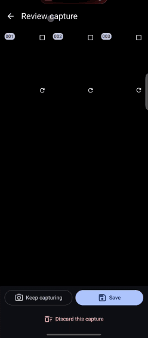

<br>
<sub><b>Hands-free capture</b> — the browser turns the page, every settled frame is saved — a <b>review grid</b> to fix things up before they become a chapter, and <b>per-site setup</b>: canvas width, trim lines, and where to tap to turn the page.</sub>
</div>

**Reader**
- **Auto webtoon detection** — long vertical strips switch to continuous-vertical reading on their own; a per-manga choice always wins.
- **In-reader chapter list** — jump to any chapter from a list inside the reader, without backing out to the details page.
- **E-ink mode** — one tap turns on grayscale, a white theme, and white-flash page refresh for e-readers.
- **Cover in progress notifications** — the background translation / night-page progress notification shows the chapter's full cover, not just an icon.

<div align="center">
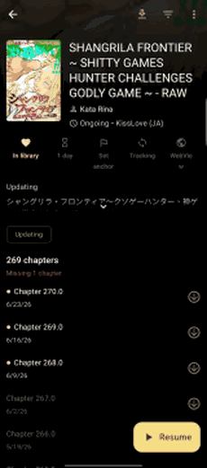
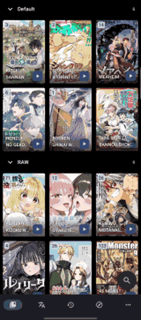
<br>
<sub>An <b>in-reader chapter list</b> and a <b>one-tap e-ink mode</b>.</sub>
</div>

**Library**
- **Drag to reorder** — a "Manual" library sort: long-press a cover and drag to set your own order, saved per category.
- **Single-list collapsible categories** — show the whole library as one scrolling list with sticky, tap-to-collapse category headers, instead of swipeable tabs.
- **Cover-based theme** — optionally tint a manga's detail screen with colors pulled from its cover.
- **Translated badge & filter** — a cover badge counts translated chapters; filter the library by translation state.
- **Per-category controls** — in the single-list view, every category header shows its own sort field and direction (tap to sort), long-press the name to rename, and a ≡ button reorders categories in a drag dialog. Drag a cover within its category to reorder, or past the boundary to move it to another.
- **Remember last categories** — adding a new title pre-checks the categories you picked last time, so you just hit *Add* (toggle in Library settings).
- **Pull-to-refresh toggle** — off by default so a stray swipe-down can't start a full library update; one switch gates the library, the details page, and the Updates screen (on the More tab) together.
- **Reading & translation statistics** — the Statistics screen adds per-day reading activity (chapters and titles read, backfilled from your history) and translation usage (chapters/pages plus LLM token counts), each with today / 7-day / 30-day / all views.

<div align="center">
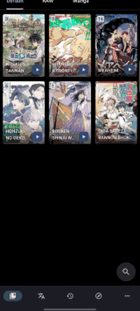
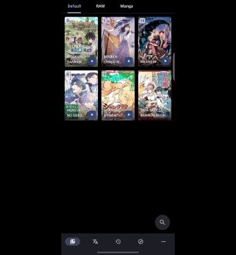
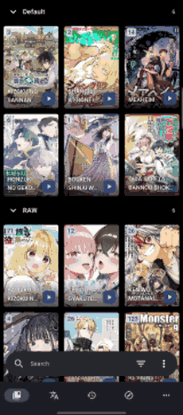
<br>
<sub><b>Drag covers into your own order</b>, collapse the whole library into <b>one list of tap-to-collapse categories</b>, and tint the detail screen to each <b>cover's colors</b>.</sub>
</div>

<div align="center">
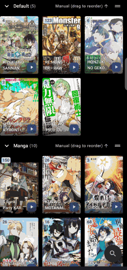
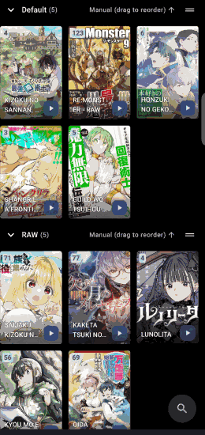
<br>
<sub><b>Per-category controls</b> in the single-list view — give each category <b>its own sort</b> (tap the header), and <b>rename or reorder</b> categories.</sub>
</div>

<div align="center">
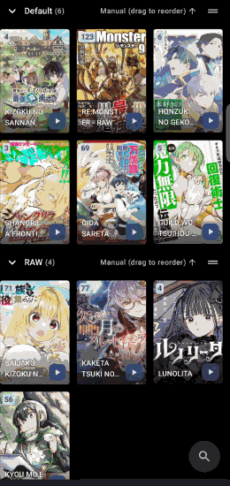
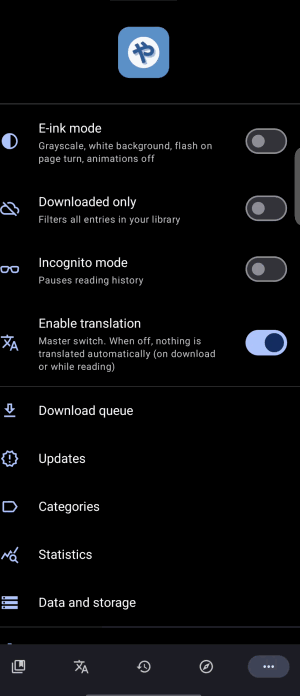
<br>
<sub><b>Drag a cover to another category</b>, and see <b>per-day statistics</b> — reading activity + translation usage (today / 7-day / 30-day / all).</sub>
</div>

**Browse & catch-up**
- **Global browse filter** — filter any source's results by *In your library* / *Started reading* / *Details fetched*, applied instantly to the loaded list without re-fetching.
- **Per-source anchor** — mark a title as your "last processed point", and a one-tap **background** task crawls the Latest feed down to it — a few pages at a time, spread over minutes and resumable across app kills/reboots (paced so the source never bans you) — saving everything above the anchor as an offline snapshot. The snapshot is trimmed to the anchor (older entries drop off, the anchor stays last, so the bottom of the list is the anchor), and the anchor stays visible with a grey flag even when the global filter would hide it.
- **Offline snapshot** — save a source's currently-loaded list and browse it later with **zero network** (lighter on the source, ban-safe).
- **Background fetch** — fetching details and chapters for a large filtered list (so they show up correctly, get update info, and can be downloaded) used to pin you to the browse screen until it finished. Now: narrow the list with the filters above, tap **Fetch details**, and walk away — it runs in the background with a progress notification you can cancel from anywhere. One title is fetched at a time (throttled to stay ban-safe); while it runs, the button shows progress instead of letting you start a second one.
- **Ban-safe pacing** — sources that punish aggressive scraping are handled two ways. Browsing/searching **doesn't prefetch pages ahead**, so the number of requests tracks your actual scrolling — this alone stops sensitive sources (e.g. Manhuagui) from banning you on the second search page. And page loads / background fetches are spaced with **randomized jitter** rather than a robotic fixed interval (itself a bot signal). The minimum page-load interval stays configurable.
- **Source-list tweaks** — tapping a source opens its Latest list directly (on by default, hiding the now-redundant per-source Latest button); the "recently used" row and the local source are hidden by default (turn them back on in Settings › Browse).
- **Auto-refresh on open** — optionally refresh a manga's chapters every time you open it.

**Search**
- **Floating search** — an optional one-handed search pill at the bottom of the library and browse screens that collapses to a ball when idle; long-press the ball for a quick menu (with filter nearest your thumb), no need to expand the bar first. Turn it on in Settings › Appearance › Display.
- **Saved searches & advanced syntax** — save a search to recall later. In the library, a space or `,` = AND, `||` = OR, `-` = exclude, `()` groups; `genre:` / `author:` / `artist:` / `source:` / `notes:` prefixes, quotes for values with spaces (`genre:"school life"`), and comparisons like `unread>0`.
- **Compact navigation bar** — an icons-only, tighter bottom bar option.

<div align="center">
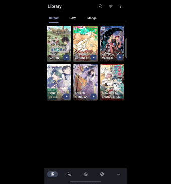
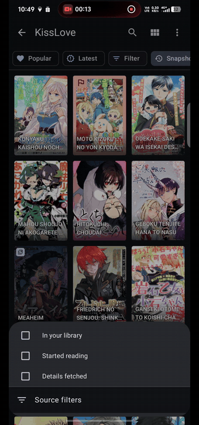
<br>
<sub>A <b>one-handed floating search</b> that idles into a ball, and a <b>global browse filter</b> on the loaded list.</sub>
</div>

<div align="center">
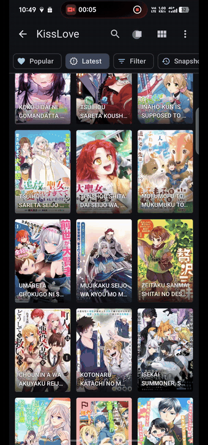
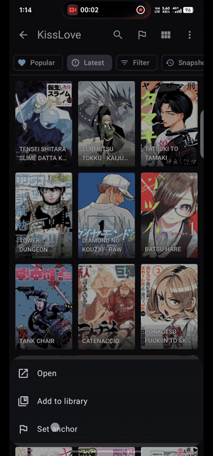
<br>
<sub><b>Catch up on any source</b> — save its loaded list as an <b>offline snapshot</b>, and <b>auto-load</b> the Latest feed down to your anchor.</sub>
</div>

**Large screens & foldables**

<div align="center">
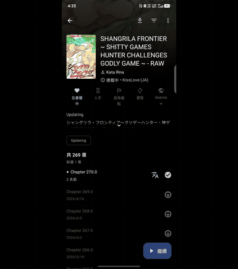
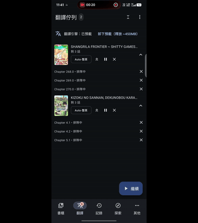
<br>
<sub><b>Fold → single page; unfold → double-page spread.</b> And the <b>translation queue</b> turns into a two-pane master-detail layout on tablets / unfolded foldables. Both pages translated on-device.</sub>
</div>

- **Adaptive grid cover size** — library and browse columns auto-fit the actual screen width (phone, tablet, folded/unfolded foldable, split-screen). Pick a size by how many fit per row and it scales to every width.
- **Tablet reading mode** — a separate reading mode for when you're on a large screen / unfolded (e.g. continuous-vertical on the phone, right-to-left paged on the tablet), following the system Tablet UI setting.
- **Double-page spread** — read two pages side by side on tablets/large screens (right-to-left or left-to-right). Wide/spread pages get their own full-width page instead of being squeezed in; a manual shift button aligns spreads split across the pairing. It's a reading mode, so it pairs with the tablet reading-mode setting above. Fill mode (fit width / fit height) and alignment are configurable under Settings → Reader → Double-page.
- **Collapsible description** — choose whether a manga's description opens expanded or collapsed.

Everything else is mihon — library, sources/extensions, downloads, trackers, backups, the reader.

## Download

Grab the latest **signed APK** from the [**Releases page**](https://github.com/joyeli/Yakuyomi/releases/latest). Take the `arm64-v8a` build for most phones, or `universal` if unsure. No build step needed — you only need to [build from source](#building) if you want to.

## How translation works

Four of the five stages run on the device; only translation leaves it. Each stage below carries the settings that tune it, so you know which knob affects which step (full list in [PARAMETERS](https://github.com/joyeli/yakuyomi-engine/blob/main/docs/PARAMETERS.md); the pipeline design lives in [yakuyomi-engine](https://github.com/joyeli/yakuyomi-engine)).

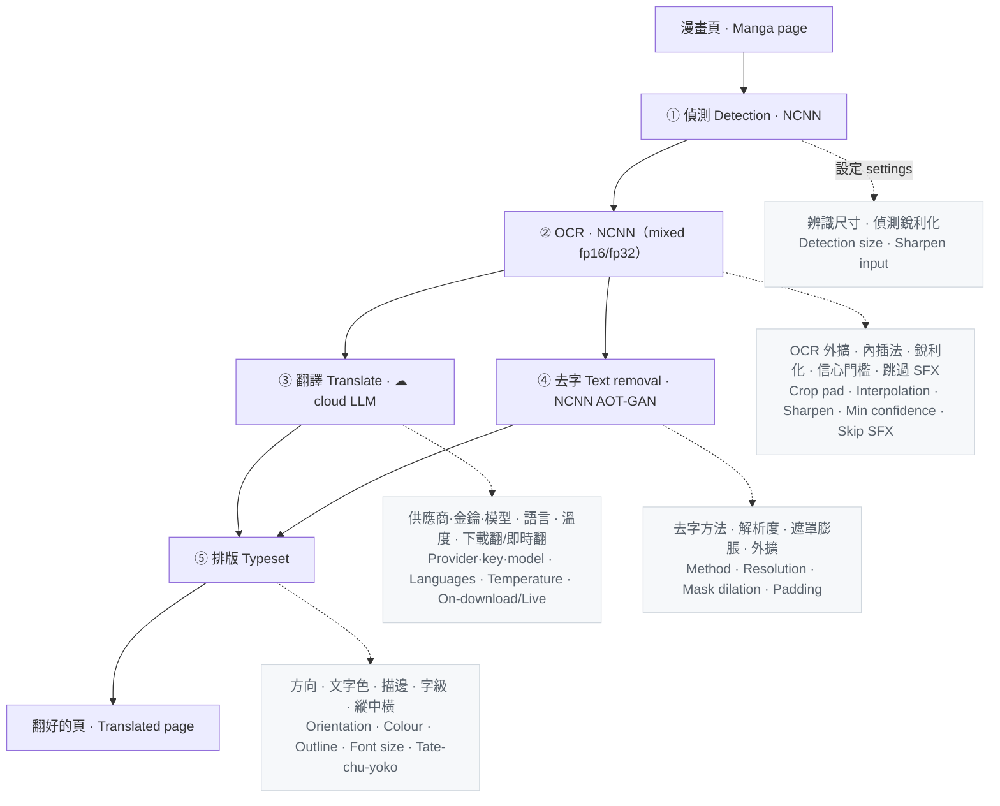

**Two layers of concurrency keep it fast.** *Within a page*, text removal (CPU) runs while the translation request is in flight (network) — the page pays only the longer of the two, not their sum. *Across pages*, the engine pipelines: while page N waits on the LLM, page N+1's detection / OCR / removal already run on-device. With the fast box-fill removal this reaches the network-bound ceiling — about **2× the sequential rate**.

## Why the LLM runs in the cloud

The heavy vision work — detection, OCR, inpainting — runs on your phone (private, free, offline). Only the OCR'd text is sent to a cloud LLM (bring your own key), because for the translation step the cloud is **almost free, faster, higher quality, and works on any phone**.

Real usage with DeepSeek (`deepseek-v4-flash`), 9 days of heavy reading:

| DeepSeek — 9 days, heavy use | cost |
|---|---|
| ~5,000 pages · ~200 chapters · ~2.7M tokens | **≈ $0.20** |
| — per chapter | ~$0.001 |
| — per month at that pace | ~$0.67 |

Running the LLM on-device instead would save that ~$0.001 per chapter — but cost you 10–40× the wait per page, plus heat, battery, gigabytes of RAM, and a flagship phone:

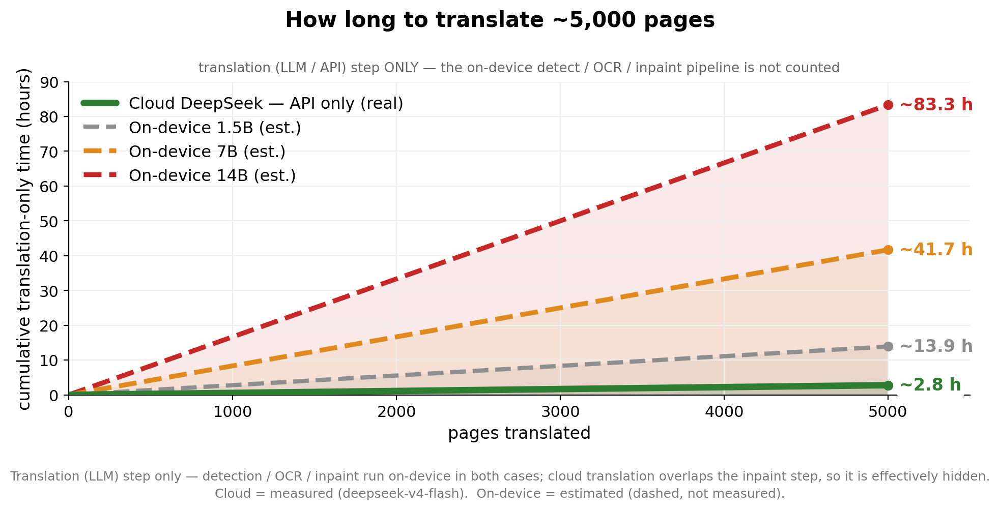

| | ☁ Cloud DeepSeek | On-device 1.5B | 7B | 14B |
|---|---|---|---|---|
| per page — translation step¹ | ~1–3s | ~10s | ~20–40s | ~40–80s |
| translation quality | high (frontier) | weak | mid | good |
| resident RAM | 0 | ~1.5 GB | ~4.5 GB | ~9 GB |
| hardware needed | any phone | mid-range+ | 8 GB+ RAM | 16 GB flagship |
| power / heat | none (off-device) | medium | high | very high |
| money | ~$0.001/chapter | $0 | $0 | $0 |
| offline | ✗ | ✓ | ✓ | ✓ |

<sub>¹ Translation (LLM) step only — detection / OCR / inpaint still run on-device in every case, so a page is **not** "one finished image per second". On-device figures are estimates (dashed in the chart), not measured.</sub>

So Yakuyomi keeps the expensive vision work on-device and sends only text to a cloud LLM: translation ends up effectively free, fast and high-quality, on any phone — while detection / OCR / inpainting keep your images on the device.

## Building

The engine is a git submodule, so clone recursively:

```sh
git clone --recurse-submodules https://github.com/joyeli/Yakuyomi.git
cd Yakuyomi
./gradlew :app:assembleDebug
```

The engine is wired in via a Gradle composite build (`includeBuild`). It compiles native code, so install NDK `28.2.13676358` and CMake `3.22.1`. The engine build and the night-reading library nested in it each look for the Android SDK on their own and don't read this repo's `local.properties`: set `ANDROID_HOME`, or put a `local.properties` with `sdk.dir=...` in both `yakuyomi-engine/` and `yakuyomi-engine/yakuyomi-nightread/`. No model weights or API keys are needed to build — you download the models and enter your LLM key inside the app. Use JDK 17 or newer (Android Studio's bundled JDK works). If you already cloned without `--recurse-submodules`, run `git submodule update --init --recursive` — the night-reading library is a submodule inside the engine submodule.

## Relation to mihon

Yakuyomi is a real mihon fork that tracks mihon's releases. On top of it sit two kinds of changes: the integration layer for the engine — download/translate hook, the shared translation and night-reading queue, translation and night-reading settings, model management, branding — and the reader, library, browse, search and capture features listed above. The on-device ML is isolated in the engine submodule (translation and night reading are separate modules there, so night reading doesn't need the translation engine; the night-reading algorithm itself is the [yakuyomi-nightread](https://github.com/joyeli/yakuyomi-nightread) library, nested inside the engine), so the engine can be tested on its own.

## Disclaimer

The developers of this application do not have any affiliation with the content providers available, and this application hosts zero content.

## License

**GPL-3.0** — see [LICENSE-YAKUYOMI.md](LICENSE-YAKUYOMI.md). Yakuyomi combines mihon (Apache-2.0, see [LICENSE](LICENSE)) with the engine — its translation part ports manga-image-translator's prompt, parameter schema, and grouping and uses GPL-3.0 model weights, and its night-reading part is the GPL-3.0 yakuyomi-nightread library — so the combined app is GPL-3.0. mihon's Apache-2.0 license and attribution are retained. The optional night-reading character-segmentation weights are not GPL-3.0: they are redistributed for research / non-commercial use only, with the attribution and terms listed in [LICENSE-YAKUYOMI.md](LICENSE-YAKUYOMI.md).

## Credits

- [mihon](https://github.com/mihonapp/mihon) — the reader this forks (Apache-2.0)
- [yakuyomi-engine](https://github.com/joyeli/yakuyomi-engine) — the on-device translation and night-reading engine
- [yakuyomi-nightread](https://github.com/joyeli/yakuyomi-nightread) — the night-reading library (GPL-3.0), nested inside the engine
- [manga-image-translator](https://github.com/zyddnys/manga-image-translator) — prompt and behaviour reference
- model weights — DBNet detection, 48px CTC OCR, and AOT-GAN inpaint — from [manga-image-translator](https://github.com/zyddnys/manga-image-translator); the on-device files are our own builds of those weights (NCNN conversions of all three; the OCR one is a mixed-precision fp16/fp32 build)
- night-reading character segmentation — [manga-page-element-segmentation](https://huggingface.co/anonimkaq4/manga-page-element-segmentation) (YOLO11-seg) and [CartoonSegmentation](https://github.com/CartoonSegmentation/CartoonSegmentation); the on-device files are our NCNN conversions (attribution and terms in [LICENSE-YAKUYOMI.md](LICENSE-YAKUYOMI.md))
