<div align="center">


# Yakuyomi

**裝置端 AI 翻譯的漫畫閱讀器。**

[English](README.md) ｜ 中文

[](LICENSE-YAKUYOMI.md)
[](https://github.com/joyeli/Yakuyomi/releases/latest)

</div>

Yakuyomi 是 [mihon](https://github.com/mihonapp/mihon) 的 fork，邊下載 / 邊讀邊把漫畫翻譯掉——預設日翻繁中，語言對可任意設定。文字的**偵測、OCR、去字都在裝置上跑**（NCNN + ONNX Runtime），只有**翻譯**這步呼叫雲端 LLM。翻譯引擎是另一個 repo [yakuyomi-engine](https://github.com/joyeli/yakuyomi-engine)，在這裡以 submodule 引入。

<div align="center">
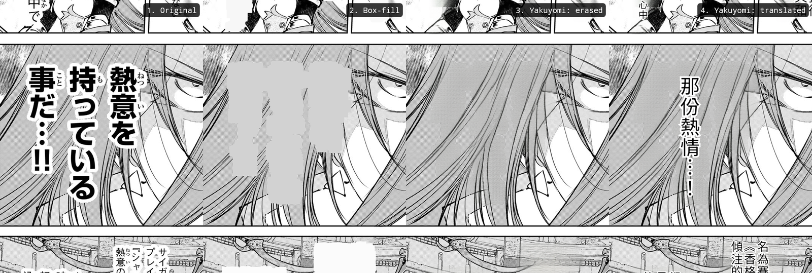
<br>
<sub><b>字壓在畫面上（頭髮、臉、背景）——正是疊字 / box-fill 翻譯的死穴。</b>Yakuyomi 把原文擦掉、重建畫面（3），再把譯文嵌回去（4）。</sub>
</div>

## Yakuyomi 的特點

以下全是疊在原版 mihon 之上的——一眼看出在這個 fork 你拿到了別人沒有的什麼：

**翻譯**
- **真去字重建，不是疊字** — 其他翻譯 fork 是在文字上蓋一塊色塊、或把新字疊上去；Yakuyomi 是把原文**擦掉、重建畫面**（AOT-GAN 去字），再把譯文排回氣泡裡。
- **裝置端 pipeline（NCNN + int8）** — 偵測（DBNet 模型）、去字跑 **NCNN** 行動核心，OCR 跑 **int8 量化**模型（比 fp32 快 ~3.6×、96.7% 一致）。從 ONNX Runtime 換過來後，模型集從 **~470 MB 縮到 ~200 MB**，而 DBNet 偵測器比它取代的舊偵測器多讀對 ~1.6–2.5× 的文字。Snapdragon 8 Gen 3 上，偵測 + OCR 跑 6 張代表頁（161 個文字框）約 **10.3 秒**、讀回 **99.4%** 的文字。純 CPU（GPU/NPU 試過、對這些模型沒幫助）。只有 LLM 翻譯那步離開裝置，圖片永遠不出手機。
- **跨頁流水線（~2× 快）** — 多頁併發翻：某頁在等雲端 LLM 時，下一頁的裝置端偵測 / OCR / 去字已經在跑。淺併發下撞到網路上限——即時 / 快速去字翻譯約**加倍**吞吐。
- **兩種工作流** — 下載時翻（整章背景翻）與邊讀邊翻；只有翻成功才覆蓋該頁，絕不用更糟的東西蓋掉原圖。
- **自備服務商與金鑰** — 任何 OpenAI 相容 LLM（預設 DeepSeek；OpenAI、Gemini、Groq、Qwen、OpenRouter、自架 Sakura、自訂），金鑰每家一格加密、模型清單即時撈（[服務商說明](https://github.com/joyeli/yakuyomi-engine/blob/main/docs/PROVIDERS_zh.md)）。
- **自備模型** — 模型集（NCNN 偵測 + 去字成對檔、int8 OCR，約 200 MB）可一鍵下載（含 sha256 驗證），或自己手動放（[模型說明](https://github.com/joyeli/yakuyomi-engine/blob/main/docs/MODELS_zh.md)）。
- **品質旋鈕** — 兩種去字模式（快速去字 / AI 去字）、直 / 橫排版、約 20 個可調參數。無 telemetry。

<div align="center">

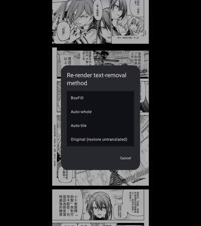
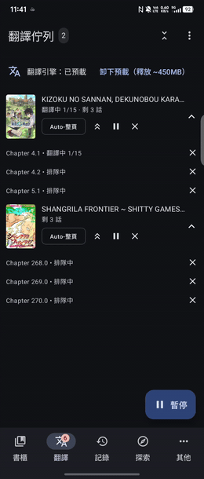
<br>
<sub><b>邊讀邊翻</b>、<b>一鍵重繪</b>換去字方法，加上<b>以漫畫分組的翻譯佇列</b>——展開章節、搶翻、整本暫停。</sub>
</div>

**擷取**
- **內建瀏覽器，截下來就是一話** — 在 Yakuyomi 內建的全螢幕瀏覽器打開任一網址，把它**顯示出來的畫面**存成頁圖、落進本機書庫。存完就是一本普通的本機漫畫：能讀、能歸分類，也能走跟其他漫畫一模一樣的裝置端 OCR 與翻譯流程。
- **半自動與全自動** — 用畫面差異雙門檻（畫面**靜止**且內容**真的變了**）自行判斷換頁並存檔，載入中那種近乎純色的過場畫面自動跳過；你只要翻頁。設好一次「點擊位置」後它會自己翻頁——模擬觸控、不對網頁注入任何腳本——整話全自動不用顧。
- **三種停止方式** — 截滿你填的本話頁數、連續兩次點擊畫面都沒變（到最後一頁或位置點錯）、或你自己按停止。無論哪一種，確認頁都會告訴你是為什麼停的。
- **逐站設定，以網域記住** — 畫布寬度（寬螢幕上把版面縮窄，一整頁就塞得進一屏）、可拖曳的上下裁切線切掉網站頁首頁尾（畫面上以灰罩常駐標示）、自動修邊（雙開頁 / 短頁多出來的空白自動去掉），以及自動翻頁的點擊位置與延遲。
- **成為一話之前先確認** — 按停止會進 3 欄縮圖網格：勾選刪除、單頁重截（會開回那頁當初的網址）、在兩頁之間補插漏掉的一頁、繼續擷取，或儲存——儲存時把剩下的頁重新編號成連續無缺號。書名可從網頁標題帶入再自己改，封面用框選截圖；本機漫畫詳情頁的「**繼續擷取**」會開回當初的網址、續截的頁存回同一本。
- **截不到的東西** — 被系統標記為受保護（DRM）的內容截出來是空白。這是刻意的，Yakuyomi 不去繞過它。

<div align="center">

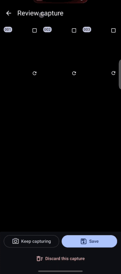

<br>
<sub><b>全自動擷取</b>——瀏覽器自己翻頁、每張穩定下來的畫面自動存檔；成為一話前的<b>確認網格</b>可以刪頁、重截、插頁；以及<b>逐站設定</b>：畫布寬度、裁切線、點哪裡翻頁。</sub>
</div>

**閱讀器**
- **自動 webtoon 偵測** — 長條直幅自動切成垂直連貫閱讀；per-manga 的選擇永遠優先。
- **閱讀器內章節清單** — 在閱讀器裡從清單跳到任一章，不必退回詳情頁。
- **墨水屏模式** — 一鍵開啟灰階、白底主題、與翻頁白閃刷新，給電子閱讀器用。
- **進度通知帶封面** — 背景翻譯的通知顯示該章完整封面，不只是個小圖示。

<div align="center">
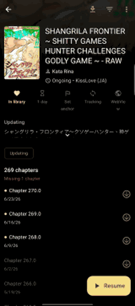

<br>
<sub><b>閱讀器內章節清單</b>與<b>一鍵墨水屏模式</b>。</sub>
</div>

**書庫**
- **拖放排序** — 「手動」書庫排序：長按封面拖曳設定自己的順序，每分類各記。
- **單清單可摺疊分類** — 把整個書庫顯示成單一清單，分類標頭黏性置頂、點一下收合，取代左右滑的分頁。
- **依封面配色** — 可選用漫畫封面的顏色為其詳情頁上色。
- **已翻徽章與篩選** — 封面徽章計每本已翻章數；可依翻譯狀態篩選書庫。
- **各分類獨立控制** — 在單一清單模式下，每個分類標頭顯示自己的排序欄位與方向（點即排序）、長按名稱可改名、≡ 鈕跳出拖曳對話框重排分類順序。封面可在分類內拖曳調序，拖出邊界即移到別的分類。
- **記住上次選的分類** — 加入新書目時自動勾選你上次選過的分類，確認按「加入」即可（書庫設定可關）。
- **下拉更新開關** — 預設關閉，避免誤觸下拉觸發整庫大量更新；一個開關同時控制書庫、詳情頁、更新分頁。
- **閱讀與翻譯統計** — 統計畫面新增每日閱讀活動（讀了幾章/幾本，可回填既有歷史）與翻譯用量（章/頁數與 LLM token），皆可切今天／近 7 天／近 30 天／全部。

<div align="center">
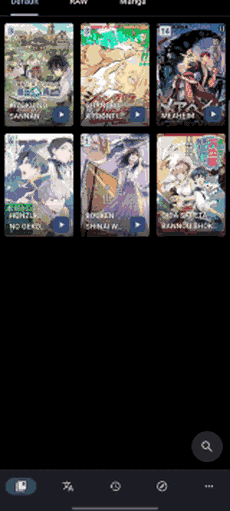
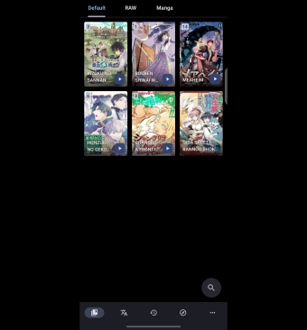
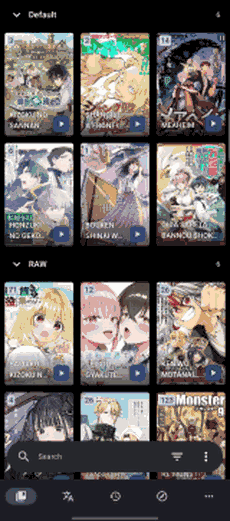
<br>
<sub><b>把封面拖成自己的順序</b>、把整個書庫收成<b>一串可點開收合的分類</b>、並讓詳情頁套上<b>封面的色調</b>。</sub>
</div>

<div align="center">
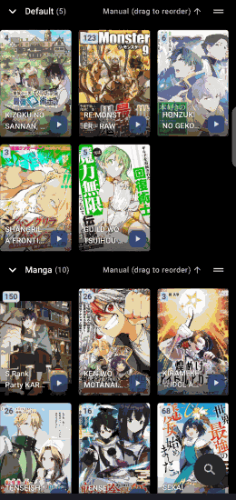
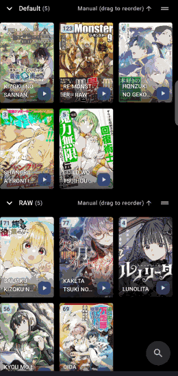
<br>
<sub><b>各分類獨立控制</b>（單一清單模式）— 每個分類<b>自己的排序</b>（點標頭），以及<b>改名與重排</b>分類。</sub>
</div>

<div align="center">
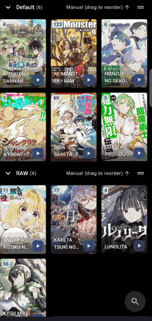
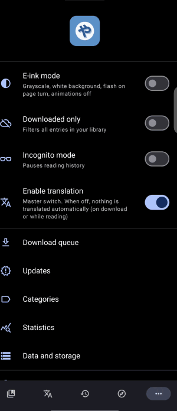
<br>
<sub><b>把封面拖到別的分類</b>，以及<b>每日統計</b> — 閱讀活動 + 翻譯用量（今天／近 7 天／近 30 天／全部）。</sub>
</div>

**瀏覽與追進度**
- **全域瀏覽篩選** — 把任一來源的結果依「已收藏 / 已開卷」就地過濾，不重抓、即時生效。
- **每來源錨點** — 把一本書標成「上次處理到這」，一鍵**背景**任務就會把「最新」清單一路爬到錨點——每次抓幾頁、隔幾分鐘、跨 app 被殺／重開機都能續傳（刻意攤開節奏，不讓來源封你）——把錨點以上全部存成離線快照。快照會修剪到錨點（更舊的自動移除、錨點永遠是最後一筆），一顆「**滑到錨點**」鈕帶你直接跳過去；即使全域篩選會把錨點濾掉，它仍以灰色旗標保留顯示。
- **離線快照** — 把某來源當下載入的清單存起來，之後**零連線**離線重看（對來源更輕、不怕被 ban）。
- **背景擷取** — 對一份很大的篩選清單擷取詳情與章節（好讓書目正確顯示、取得更新資訊、可下載）以前會把你**釘在瀏覽畫面**乾等到跑完。現在：用上面的篩選把清單縮小、按「**擷取詳情**」、走人——擷取在背景跑，進度通知可在任何地方取消。一次只擷取一本（有節流防 ban）；跑的時候按鈕顯示進度、不讓你再送第二份。
- **防 ban 節奏** — 對付會嚴懲爬蟲的來源用兩招。瀏覽／搜尋**不再提前連抓下一頁**，送出的請求數 ≈ 你實際捲動的量——光這點就讓漫画柜這類敏感來源不再在搜尋第二頁就封你。翻頁與背景擷取則加上**隨機抖動延遲**、而非固定間隔（固定心跳本身就是機器人訊號）。翻頁最小間隔仍可設定。
- **來源列表微調** — 點來源直接進「最新」清單（預設開，並隱藏多餘的來源「最新」按鈕）；可選擇不顯示「最近使用」欄與本地來源。
- **開啟即刷新** — 可選每次打開漫畫就刷新章節。

**搜尋**
- **浮動搜尋** — 可選的底部單手搜尋膠囊，閒置時縮成小球；長壓小球彈出快捷選單（篩選放最就手），不必先展開。
- **已存搜尋與進階語法** — 把搜尋存起來日後重用；`,` = AND、`-` = 排除，並有 `genre:` / `author:` / `artist:` 前綴做精準書庫查詢。
- **精簡導覽列** — 可選僅圖示、更緊緻的底部導覽列。

<div align="center">
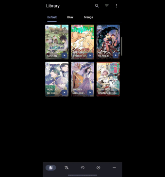
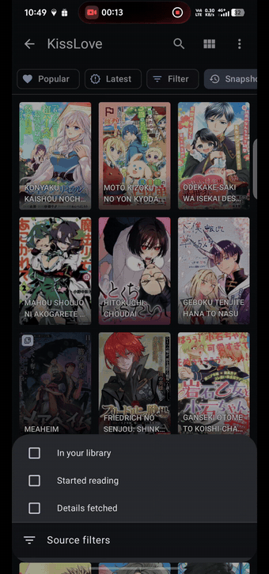
<br>
<sub><b>單手浮動搜尋</b>（閒置縮成球），以及對載入清單就地套用的<b>全域瀏覽篩選</b>。</sub>
</div>

<div align="center">
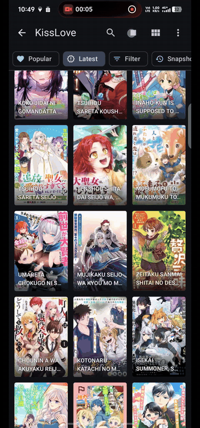
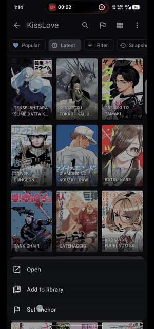
<br>
<sub><b>在任一來源追進度</b>——把載入的清單存成<b>離線快照</b>，並<b>自動載入</b>往下捲到你標的錨點。</sub>
</div>

**大螢幕與折疊機**

<div align="center">

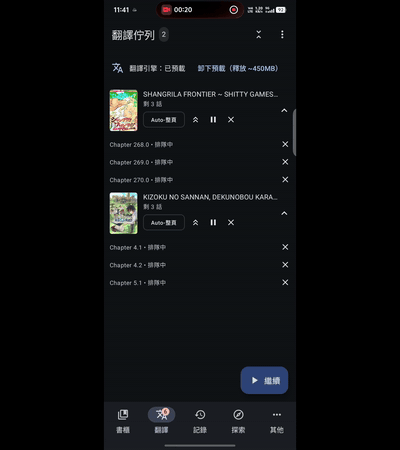
<br>
<sub><b>合起來 → 單頁；打開來 → 自動雙開。</b>翻譯佇列在平板／折疊機展開時也變成<b>主從雙欄</b>（左清單、右章節）。兩頁都在裝置上翻好。</sub>
</div>

- **自適應網格封面大小** — 書庫與探索的欄數依實際螢幕寬度自動調整（手機、平板、折疊機折/展、分割畫面）。用「每行幾個」挑大小，會對所有寬度自動換算。
- **平板閱讀模式** — 在大螢幕／展開時可套用另一種閱讀模式（例如手機用垂直連貫、平板用右至左翻頁），跟著系統「平板介面」設定切換。
- **對開閱讀** — 平板／大螢幕兩頁並排（右至左或左至右）。跨頁大圖會單獨佔整版、不被擠成小圖；遇到跨頁被配對邊界拆開可按「位移」鈕對齊。它本身是一個閱讀模式，能搭配上面的「平板閱讀模式」設定使用。填滿方式（寬度／高度為主）與對齊可在 設定 → 閱讀 → 對開 調整。
- **可摺疊簡介** — 可選漫畫簡介預設展開或摺疊。

其餘全是 mihon——書庫、來源 / 擴充、下載、追蹤、備份、閱讀器。

## 下載

到 [**Releases 頁面**](https://github.com/joyeli/Yakuyomi/releases/latest) 抓最新的**簽章 APK**。多數手機用 `arm64-v8a`，不確定就用 `universal`。不用自己 build，想 build 才[從原始碼建置](#編譯)。

## 翻譯怎麼運作

五階段裡四個在裝置上跑，只有翻譯離開裝置。下圖每個階段標出可調它的設定，讓你一眼知道哪個旋鈕影響哪一步（完整清單見 [PARAMETERS](https://github.com/joyeli/yakuyomi-engine/blob/main/docs/PARAMETERS_zh.md)；pipeline 設計在 [yakuyomi-engine](https://github.com/joyeli/yakuyomi-engine)）。

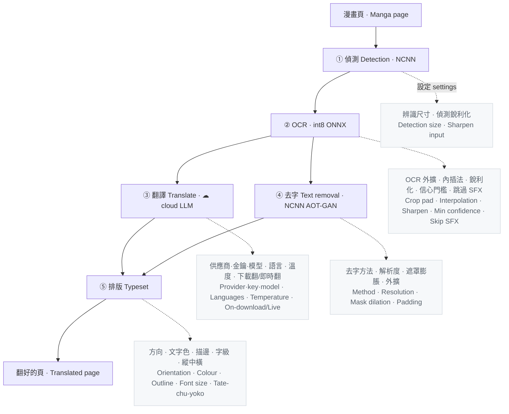

**兩層併發撐住速度。** *頁內*：去字（CPU）在翻譯請求飛在網路上時同時跑——一頁只付兩者中較長的那個、不是相加。*跨頁*：引擎流水線化——第 N 頁在等 LLM 時，第 N+1 頁的偵測 / OCR / 去字已經在裝置上跑。搭配快速的平塗去字就撞到網路上限——約 **2× 循序速率**。

## 為什麼翻譯走雲端

耗算力的視覺工作——偵測、OCR、去字——都在你手機上跑（私密、免費、離線）。只有 OCR 出來的**文字**送到雲端 LLM（自備金鑰），因為翻譯這一步，雲端**幾乎免費、更快、品質更高、而且任何手機都能用**。

用 DeepSeek（`deepseek-v4-flash`）9 天重度閱讀的真實用量：

| DeepSeek — 9 天重度使用 | 花費 |
|---|---|
| ~5,000 頁 · ~200 章 · ~2.7M token | **≈ $0.20** |
| — 每章 | ~$0.001 |
| — 此用量下每月 | ~$0.67 |

把 LLM 搬回裝置端，省下的是每章 ~$0.001——換來的卻是每頁慢 10–40 倍，外加發熱、吃電、佔數 GB 記憶體、還得要旗艦機：

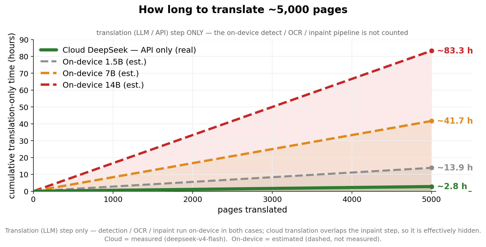

| | ☁ 雲端 DeepSeek | 裝置端 1.5B | 7B | 14B |
|---|---|---|---|---|
| 每頁 — 只算翻譯步驟¹ | ~1–3s | ~10s | ~20–40s | ~40–80s |
| 翻譯品質 | 高（前沿大模型）| 弱 | 中 | 好 |
| 常駐記憶體 | 0 | ~1.5 GB | ~4.5 GB | ~9 GB |
| 硬體門檻 | 任何手機 | 中階+ | 8 GB+ RAM | 16 GB 旗艦 |
| 電 / 熱 | 無（不在裝置）| 中 | 高 | 很高 |
| 金錢 | ~$0.001/章 | $0 | $0 | $0 |
| 離線 | ✗ | ✓ | ✓ | ✓ |

<sub>¹ 只算翻譯（LLM）這一步——偵測 / OCR / 去字在任何情況下都仍在裝置上跑，所以**不是**「一秒生一張完成圖」。裝置端數字是概估（圖中虛線），非實測。</sub>

所以 Yakuyomi 把耗算力的視覺工作留在裝置、只把文字送雲端 LLM：翻譯實際上等於免費、又快又高品質、任何手機都能跑——而偵測 / OCR / 去字讓你的圖片留在裝置上。

## 編譯

引擎是 git submodule，所以要遞迴 clone：

```sh
git clone --recurse-submodules https://github.com/joyeli/Yakuyomi.git
cd Yakuyomi
./gradlew :app:assembleDebug
```

引擎透過 Gradle composite build（`includeBuild`）接進來。編譯不需要模型權重或 API 金鑰——模型在 app 內下載、LLM 金鑰在 app 內輸入。

## 與 mihon 的關係

Yakuyomi 是真正的 mihon fork：跟著 mihon 的閱讀器走，只加整合層——下載 / 翻譯 hook、翻譯設定、模型管理、品牌。裝置端 ML 隔離在引擎 submodule 裡，所以閱讀器維持 mihon 的樣子、引擎也能自己單獨測。

## 免責聲明

本應用程式的開發者與內容提供方無任何關聯，且本應用程式不託管任何內容。

## 授權

**GPL-3.0** — 見 [LICENSE-YAKUYOMI.md](LICENSE-YAKUYOMI.md)。Yakuyomi 把 mihon（Apache-2.0，見 [LICENSE](LICENSE)）與翻譯引擎結合；引擎移植了 manga-image-translator 的 prompt / 參數 schema / 分組、並用 GPL-3.0 模型權重，故組合後的 app 為 GPL-3.0。mihon 的 Apache-2.0 授權與歸屬予以保留。

## 致謝

- [mihon](https://github.com/mihonapp/mihon) — 本專案 fork 的閱讀器（Apache-2.0）
- [yakuyomi-engine](https://github.com/joyeli/yakuyomi-engine) — 裝置端翻譯引擎
- [manga-image-translator](https://github.com/zyddnys/manga-image-translator) — prompt 與行為參考
- 模型權重 — DBNet 偵測、48px CTC OCR、AOT-GAN 去字 — 來自 [manga-image-translator](https://github.com/zyddnys/manga-image-translator)；裝置端的模型檔是我們自己拿這些權重轉的（偵測與去字轉成 NCNN、OCR 是 int8 量化的 ONNX export）
